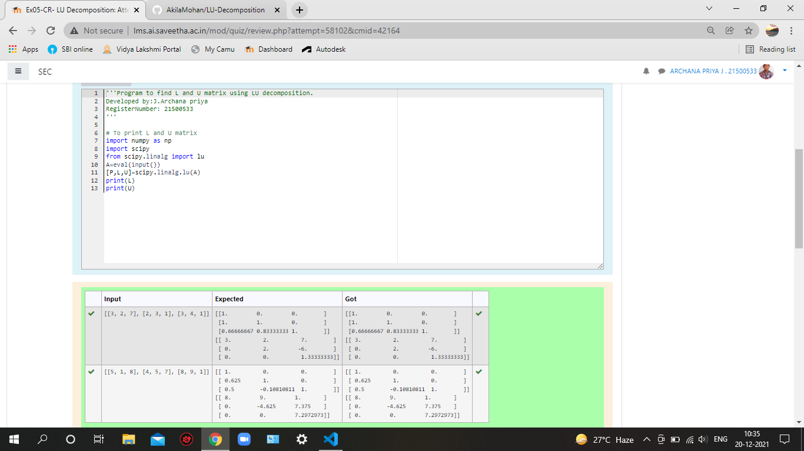

# LU Decomposition without zero on the diagonal

## AIM:
To write a program to find the LU Decomposition of a matrix.

## Equipments Required:
1. Hardware – PCs
2. Anaconda – Python 3.7 Installation / Moodle-Code Runner

## Algorithm
1. import numpy as np.
2. import scipy using library linalg.
3. Solve using scipy.linalg.lu(variable)
4. Print the output. 

## Program:
```
/* 
Program to find the LU Decomposition of a matrix.
Developed by: J.Archana Priya 
RegisterNumber:21500533
import numpy as np
import scipy
from scipy.linalg import lu         
A=eval(input())
[P,L,U]=scipy.linalg.lu(A)
print(L)
print(U) 
*/
```
## Program 2:
```
Developed by:J.Archana Priya
Register no.:21500533

import numpy as np
from scipy.linalg import lu_factor,lu_solve
A=eval(input())
B=eval(input())
lu,piv=lu_factor(A)
x=lu_solve((lu, piv),B)
print(x)
```

## Output:



## Result:
Thus the program to find the LU Decomposition of a matrix is written and verified using python programming.

